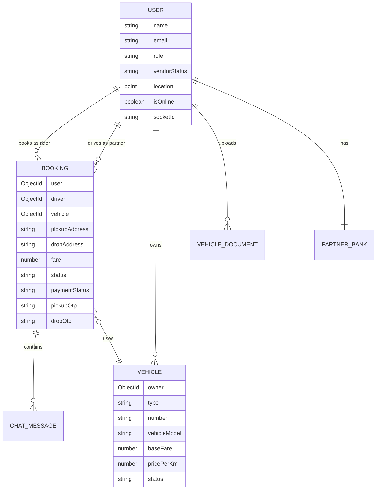

<p align="center">
  
</p>

<h1 align="center">RYDEX</h1>
<h3 align="center">Smart Multi-Vendor Vehicle Booking Platform</h3>

<p align="center">
  <strong>Book Any Vehicle — From daily rides to heavy transport, all in one platform.</strong>
</p>

<p align="center">
  
  
  
  
  
  
  
</p>

---

## 📖 Overview

**Rydex** is a production-grade, multi-vendor ride-hailing and vehicle booking platform — similar to Uber or Ola — built with modern web technologies. It connects **riders** who need transportation with **vehicle partners (vendors)** who provide them, all managed by an **admin** dashboard.

The platform supports booking bikes, autos, cars, loading vehicles, and trucks with real-time GPS tracking, in-ride chat, secure payments, and a full vendor onboarding pipeline with Video KYC verification.

---

## Features

### 🧑‍💼 For Riders (Users)
- **Search & Book** vehicles by category (Bike, Auto, Car, Loading, Truck)
- **Interactive Map** with pickup/drop location selection via Leaflet
- **Real-Time Tracking** of driver location during the ride
- **In-Ride Chat** with the driver via Socket.IO
- **Multiple Payment Options** — Razorpay, Stripe, or Cash
- **OTP Verification** for pickup and drop-off safety
- **Booking History** with status tracking

### 🚘 For Partners (Vendors / Drivers)
- **Multi-Step Onboarding** with document uploads and vehicle registration
- **Video KYC** verification powered by ZegoCloud
- **Vendor Dashboard** with earnings analytics and ride management
- **Accept/Reject** incoming ride requests in real-time
- **Live Location Sharing** with automatic geolocation updates
- **Bank Details** management for payouts

### 🛡️ For Admins
- **Admin Dashboard** with revenue analytics and charts (Recharts)
- **Vendor Management** — approve, reject, or block vendors
- **Vehicle Approval** workflow with document review
- **Earnings & Commission** tracking across all bookings
- **Booking Status** overview with visual charts

### 🔧 Platform-Wide
- **Authentication** — Email/Password + Google OAuth (NextAuth v5)
- **Role-Based Access Control** — User, Vendor, Admin middleware
- **Real-Time Events** — Socket.IO for live updates, chat, and notifications
- **Image Uploads** — Cloudinary integration for vehicle and document photos
- **Email Notifications** — OTP and status updates via Nodemailer
- **Geospatial Queries** — MongoDB 2dsphere indexing for nearby driver search

---

## 🏗️ Architecture

```
┌─────────────────────────────────────────────────────────────┐
│                         Client                              │
│  Next.js 16 (App Router) + React 19 + TailwindCSS          │
│  ┌──────────┐ ┌──────────┐ ┌──────────┐ ┌──────────┐       │
│  │  Rider   │ │ Partner  │ │  Admin   │ │  Auth    │       │
│  │  Pages   │ │Dashboard │ │Dashboard │ │  Modal   │       │
│  └──────────┘ └──────────┘ └──────────┘ └──────────┘       │
│        ↕ API Routes          ↕ Redux         ↕ Socket.IO   │
├─────────────────────────────────────────────────────────────┤
│                     Next.js API Routes                      │
│  /api/auth  /api/booking  /api/payment  /api/partner  ...  │
├─────────────────────────────────────────────────────────────┤
│                    Socket.IO Server                         │
│  Real-time: Location · Chat · Ride Events · Notifications  │
├─────────────────────────────────────────────────────────────┤
│                       MongoDB                               │
│  Users · Bookings · Vehicles · Documents · Chat · Banks    │
└─────────────────────────────────────────────────────────────┘
```

---

## 📁 Project Structure

```
ps-2/
├── rydex/                          # Next.js Frontend + API
│   ├── public/                     # Static assets (hero image, logo, icons)
│   └── src/
│       ├── app/
│       │   ├── page.tsx            # Landing page (role-based routing)
│       │   ├── layout.tsx          # Root layout with providers
│       │   ├── book/               # Vehicle booking page
│       │   ├── search/             # Vehicle search with map
│       │   ├── ride/[id]/          # Active ride tracking
│       │   ├── bookings/           # Booking history
│       │   ├── checkout/           # Payment checkout
│       │   ├── partner/
│       │   │   ├── onboard/        # Multi-step vendor onboarding
│       │   │   ├── active-ride/    # Driver's active ride view
│       │   │   ├── pending-requests/ # Incoming ride requests
│       │   │   └── bookings/       # Partner booking history
│       │   ├── admin/
│       │   │   ├── dashboard/      # Admin analytics dashboard
│       │   │   ├── vendors/        # Vendor management
│       │   │   └── vehicles/       # Vehicle approval
│       │   ├── video-kyc/[roomId]/ # Video KYC room
│       │   └── api/
│       │       ├── auth/           # NextAuth endpoints
│       │       ├── booking/        # CRUD + accept/reject/complete
│       │       ├── payment/        # Razorpay/Stripe integration
│       │       ├── partner/        # Vendor onboarding APIs
│       │       ├── admin/          # Admin management APIs
│       │       ├── vehicles/       # Vehicle CRUD
│       │       ├── chat/           # Chat message persistence
│       │       ├── user/           # User profile APIs
│       │       ├── socket/         # Socket event helpers
│       │       └── zego/           # ZegoCloud token generation
│       ├── components/
│       │   ├── Nav.tsx             # Navigation bar
│       │   ├── AuthModal.tsx       # Login/Register modal
│       │   ├── HeroSection.tsx     # Landing hero section
│       │   ├── LiveTrackingMap.tsx  # Real-time driver tracking map
│       │   ├── RouteMap.tsx        # Route visualization map
│       │   ├── RideChat.tsx        # In-ride messaging
│       │   ├── VendorDashboard.tsx # Partner dashboard
│       │   ├── VehicleBookingCard.tsx
│       │   ├── VehicleCategoriesSlider.tsx
│       │   ├── AdminEarning.tsx    # Admin revenue charts
│       │   ├── AdminStatusChart.tsx
│       │   ├── PartnerEarningChart.tsx
│       │   ├── GeoUpdater.tsx      # Background location updater
│       │   ├── Footer.tsx
│       │   └── PublicHome.tsx
│       ├── models/                 # Mongoose schemas
│       │   ├── user.model.ts
│       │   ├── booking.model.ts
│       │   ├── vehicle.model.ts
│       │   ├── vehicleDocument.model.ts
│       │   ├── chatMessage.model.ts
│       │   └── partnerBank.model.ts
│       ├── lib/                    # Utility modules
│       │   ├── db.ts               # MongoDB connection
│       │   ├── cloudinary.ts       # Image upload config
│       │   ├── mailer.ts           # Nodemailer transport
│       │   ├── razorpay.ts         # Razorpay client
│       │   ├── stripe.ts           # Stripe client
│       │   └── socket.ts           # Socket.IO client singleton
│       ├── redux/                  # State management
│       │   ├── store.ts
│       │   ├── userSlice.ts
│       │   └── StoreProvider.tsx
│       ├── auth.ts                 # NextAuth configuration
│       ├── proxy.ts                # Middleware (role-based routing)
│       └── hooks/                  # Custom React hooks
│
└── socketServer/                   # Standalone Socket.IO Server
    ├── index.js                    # WebSocket event handlers
    ├── models/
    │   └── user.models.js          # Shared User schema
    └── package.json
```

---

## 🚀 Getting Started

### Prerequisites

- **Node.js** ≥ 18.x
- **npm** ≥ 9.x
- **MongoDB** — A MongoDB Atlas cluster or local MongoDB instance
- Accounts for external services (see Environment Variables below)

### 1. Clone the Repository

```bash
git clone https://github.com/Piyush-ouch/ps-2.git
cd ps-2
```

### 2. Install Dependencies

```bash
# Frontend (Next.js)
cd rydex
npm install

# Socket Server (in a separate terminal)
cd ../socketServer
npm install
```

### 3. Configure Environment Variables

Copy the example files and fill in your credentials:

```bash
# Frontend
cp rydex/.env.example rydex/.env

# Socket Server
cp socketServer/.env.example socketServer/.env
```

#### `rydex/.env`

| Variable | Description |
|---|---|
| `MONGODB_URL` | MongoDB connection string |
| `AUTH_SECRET` | NextAuth secret (generate with `openssl rand -base64 32`) |
| `GOOGLE_CLIENT_ID` | Google OAuth Client ID |
| `GOOGLE_CLIENT_SECRET` | Google OAuth Client Secret |
| `CLOUDINARY_CLOUD_NAME` | Cloudinary cloud name |
| `CLOUDINARY_API_KEY` | Cloudinary API key |
| `CLOUDINARY_API_SECRET` | Cloudinary API secret |
| `RAZORPAY_KEY_ID` | Razorpay key ID |
| `RAZORPAY_KEY_SECRET` | Razorpay key secret |
| `STRIPE_SECRET_KEY` | Stripe secret key |
| `ZEGO_APP_ID` | ZegoCloud App ID |
| `ZEGO_SERVER_SECRET` | ZegoCloud Server Secret |
| `EMAIL` | Gmail address for sending OTPs |
| `PASS` | Gmail App Password |
| `NEXT_PUBLIC_APP_URL` | Frontend URL (default: `http://localhost:3000`) |
| `NEXT_PUBLIC_SOCKET_SERVER` | Socket server URL (default: `http://localhost:5000`) |
| `NEXT_PUBLIC_RAZORPAY_KEY` | Razorpay public key |
| `NEXT_PUBLIC_ZEGO_APP_ID` | ZegoCloud public App ID |
| `NEXT_PUBLIC_ZEGO_SERVER_SECRET` | ZegoCloud public Server Secret |

#### `socketServer/.env`

| Variable | Description |
|---|---|
| `MONGODB_URL` | Same MongoDB connection string as above |
| `PORT` | Server port (default: `5000`) |
| `NEXT_BASE_URL` | Frontend URL for CORS (default: `http://localhost:3000`) |

### 4. Run the Application

You need **two terminals** to run both services:

```bash
# Terminal 1 — Next.js Frontend
cd rydex
npm run dev
# → Runs at http://localhost:3000

# Terminal 2 — Socket.IO Server
cd socketServer
npm run dev
# → Runs at http://localhost:5000
```

---

## 🔌 API Reference

### Authentication
| Method | Endpoint | Description |
|---|---|---|
| POST | `/api/auth/register` | Register new user |
| POST | `/api/auth/[...nextauth]` | NextAuth sign-in/sign-out |

### Bookings
| Method | Endpoint | Description |
|---|---|---|
| POST | `/api/booking/create` | Create a new booking |
| GET | `/api/booking/[id]` | Get booking details |
| POST | `/api/booking/[id]/accept` | Driver accepts a booking |
| POST | `/api/booking/[id]/reject` | Driver rejects a booking |

### Payments
| Method | Endpoint | Description |
|---|---|---|
| POST | `/api/payment/create` | Initiate Razorpay/Stripe payment |
| POST | `/api/payment/verify` | Verify payment signature |

### Vehicles
| Method | Endpoint | Description |
|---|---|---|
| GET | `/api/vehicles` | List available vehicles |
| POST | `/api/vehicles` | Register a new vehicle |

### Partner
| Method | Endpoint | Description |
|---|---|---|
| POST | `/api/partner/onboard` | Submit onboarding data |
| GET | `/api/partner/earnings` | Get partner earnings |

### Admin
| Method | Endpoint | Description |
|---|---|---|
| GET | `/api/admin/vendors` | List all vendors |
| POST | `/api/admin/vendors/approve` | Approve a vendor |
| POST | `/api/admin/vendors/reject` | Reject a vendor |

---

## 🔄 Real-Time Events (Socket.IO)

| Event | Direction | Description |
|---|---|---|
| `identity` | Client → Server | Register user's socket ID |
| `update-location` | Client → Server | Update driver GPS coordinates |
| `join-booking` | Client → Server | Join a booking room |
| `driver-location-update` | Client → Server | Broadcast driver location to rider |
| `driver-location` | Server → Client | Receive live driver coordinates |
| `chat-message` | Bidirectional | Send/receive in-ride chat messages |
| `new-booking-request` | Server → Client | Notify driver of new booking |
| `booking-accepted` | Server → Client | Notify rider booking was accepted |
| `booking-rejected` | Server → Client | Notify rider booking was rejected |

---

## 🛠️ Tech Stack

| Category | Technology |
|---|---|
| **Framework** | Next.js 16 (App Router, Turbopack) |
| **UI** | React 19, TailwindCSS 4, Framer Motion |
| **Language** | TypeScript 5 |
| **Database** | MongoDB with Mongoose |
| **Auth** | NextAuth v5 (Credentials + Google OAuth) |
| **Real-Time** | Socket.IO 4.8 |
| **Maps** | Leaflet + React-Leaflet |
| **Payments** | Razorpay + Stripe |
| **Media** | Cloudinary |
| **Video KYC** | ZegoCloud |
| **State** | Redux Toolkit |
| **Charts** | Recharts |
| **Email** | Nodemailer |
| **Icons** | Lucide React |

---

## 📊 Database Models



---

## 🤝 Contributing

Contributions are welcome! Here's how to get started:

1. **Fork** the repository
2. **Create** a feature branch: `git checkout -b feature/amazing-feature`
3. **Commit** your changes: `git commit -m "feat: add amazing feature"`
4. **Push** to the branch: `git push origin feature/amazing-feature`
5. **Open** a Pull Request

### Contribution Guidelines

- Follow the existing code style and folder structure
- Write descriptive commit messages following [Conventional Commits](https://www.conventionalcommits.org/)
- Test your changes locally before submitting a PR
- Update documentation if you change APIs or add new features

---

## 📜 License

This project is open source and available under the [MIT License](LICENSE).

---

## 🙏 Acknowledgements

- [Next.js](https://nextjs.org/) — React framework
- [Socket.IO](https://socket.io/) — Real-time communication
- [Leaflet](https://leafletjs.com/) — Interactive maps
- [Razorpay](https://razorpay.com/) & [Stripe](https://stripe.com/) — Payment processing
- [ZegoCloud](https://www.zegocloud.com/) — Video KYC
- [Cloudinary](https://cloudinary.com/) — Media management
- [MongoDB](https://www.mongodb.com/) — Database

---

<p align="center">
  Made with ❤️ by the Rydex Team
</p>
